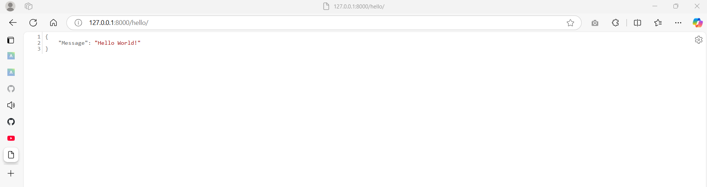

# Hello World Django Application

---

## Introduction

This is a Simple Hello World Django Application created as per the requirements for Lab - 5 of the course: "Software Architecture and Design" taught by Professor "Dr. Fadi Wedyan".

The /hello route returns  a JSON Response: {"Message": "Hello World!"} to the user on the screen.

---

## Requirements to run the project

* Git 
* Python - 3.10 (Any 3.x version would suffice too)
* Django

---

## Instructions to run the project

### Cloning the Project

First step is to clone the project in your laptop.

Execute the following command in your Computer.
```commandline
git clone https://github.com/Jags8421/Hello-World-Django.git

cd HelloWorld_Project
```

### Creating and Activating the Virtual Environment

Next step is to create and activate the virtual environment.

First of all we need to cd to the Project Directory.

```commandline
cd HelloWorld_Project
```

Create a Virtual Environment
```commandline
python -m venv venv
```

Activating the Virtual Environment for Linux/Mac Computers
```commandline
source venv/bin/activate
```

Activating the Virtual Environment for Windows Computers
```commandline
venv\Scripts\activate
```

### Installing the Requirements

Run the following command to install the requirements in your virtual environment.

```commandline
pip install -r requirements.txt
```

### Running the Server / Application

Execute the following command to run the project

```commandline
python manage.py runserver
```
---
## Viewing the Output

Once the Server / Application is up and running, open the browser, and enter the following URL
`http://127.0.0.1:8000/hello/`

After the URL is entered, you must see the following response:

```json
{
  "Message": "Hello World!"
}
```

Screenshot of a Sample Output:


You can also check the output in the Network Tab of Developer Console.
